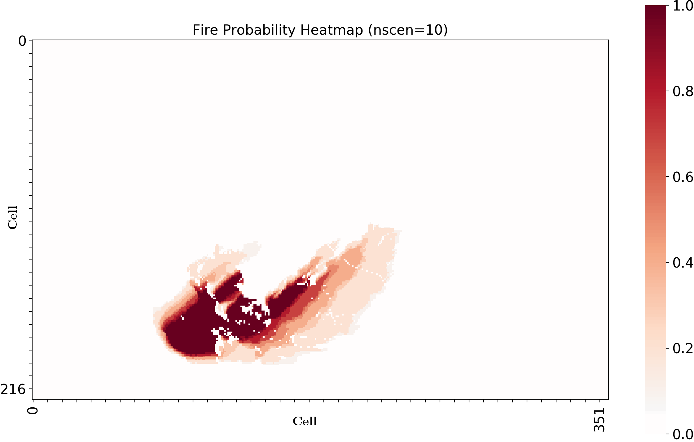

{: .warning}
Código C++ de línea de comandos; Consulta la versión gráfica amigable: [fire2a toolbox](docs/qgis-toolbox/README.html)
# Cell2Fire++
{: .no_toc}
<details closed markdown="block">
  <summary>
    Tabla de contenidos
  </summary>
  {: .text-delta }
1. TOC
{:toc}
</details>

Cell2Fire es un simulador de incendios forestales y de paisajes silvestres basado en una cuadrícula 2D, enfocado en áreas a gran escala y simulaciones rápidas para proporcionar análisis de riesgos espaciales robustos, aprovechando los métodos de cálculo paralelo de c++.

Version actual
- [W](https://github.com/fire2a/c2f-w) incluye los tres modelos de comportamiento de combustible!

Sabores liberados (*ya no se mantienen, solo para archivo*):
- [Scott & Burgan](https://github.com/fire2a/C2FSB)
- [Kitral](https://github.com/fire2a/C2FK)
- [FBP](https://github.com/fire2a/C2FFBP)

El [original](https://github.com/cell2fire/Cell2Fire/)

# Ejemplos de salida

## Scott & Burgan
### Zona 60 de Previncat (Instancia Catalana): bosque y propagación de fuego simulada con su correspondiente cicatriz y árbol de propagación de crecimiento.

### Metricas de riesgo: Probabilidad de quema (BP), Centralidad de Intermediación (BC), Valor de Protección Agua Abajo (DPV), y Árbol de Propagación de Crecimiento (GPT).


## Kitral
### El Portillo, simulación con comportamiento de fuego de copa.


## Sistema Canadiense de Predicción de Comportamiento de Incendios Forestales

|:-------------|:------------------|
| Bosque Dogrib, Canada {: width="100%" } | shortest paths propagation {: width="80%" } |
| Caminos más cortos de propagación e intensidad ROS {: width="100%" } | Burn-Probability {: width="80%" } |


# Compilación
Lanzamientos precompilados, los usuarios normales probablemente no necesitan esta guía.

Verifica los [artefactos de acción del repositorio](https://github.com/fire2a/C2F-W/actions) para la última actualización de las compilaciones automáticas.

## UNIX Overview
```bash
# install build-essentials, gcc-12, boost, eigen3 & openmp

cd
git clone git@github.com:fire2a/C2F-W.git

# go to c++ files
cd C2F-W/Cell2FireC

# clean & build [select platform makefile]
make clean [-f custom_makefile]
make [-f custom_makefile]

```
### developer setup
```bash
# rename binary for the QGIS toolbox plugin
ext=`python3 -c "import platform;print(f'.{platform.system()}.{platform.machine()}')"`
cp Cell2Fire Cell2Fire$ext

cd
git clone git@github.com:fire2a/fire-analytics-qgis-processing-toolbox-plugin.git fire-toolbox

source ~/your/venv/bin/activate
(venv) $ pip install -r fire-toolbox/fireanalyticstoolbox/requirements.txt

git clone git@github.com:fire2a/fire2a-lib
cd fire2a-lib
(venv) $ pip install -e .

# symlink C2F-W repo into C2F directory of the fire2a-toolbox repo
ln -s C2F-W fire-toolbox/fireanalyticstoolbox/simulator/C2F

cd ~/.local/share/QGIS/QGIS3/profiles/default/python/plugins
ln -s ~/source/fire-toolbox/fireanalyticstoolbox .
```
Next time you start QGIS, look for fire2a-toolbox icon , on the Processing Toolbox panel.

## Linux
[Make](compile_linux.html)

## Macos
[Make](compile_macos.html)

## Windows
[Using Visual Studio](compile_windows.html)
