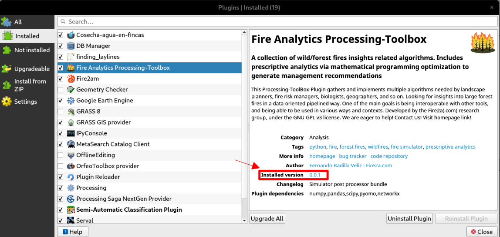
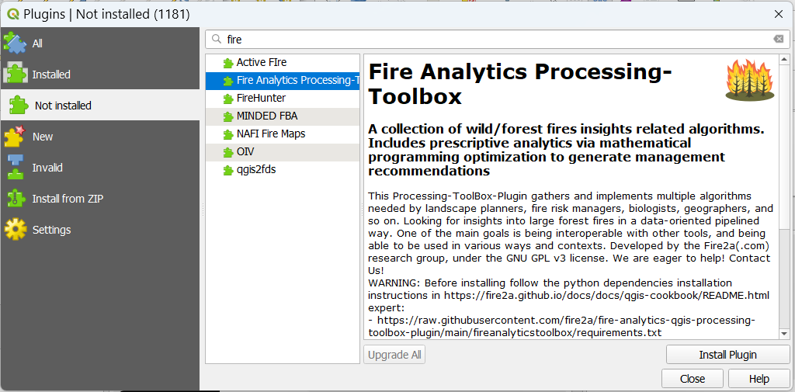

<h1>
QGIS cookbook
</h1>
{: .no_toc}
<details open markdown="block">
  <summary>
    Table of contents
  </summary>
  {: .text-delta }
1. TOC
{:toc}
</details>
# Getting Help 🚑

Before reaching out, make the sanity test:
* QGIS is updated (please try switching from LTR to latest)
* Fire2a toolbox is updated (`Menu : Plugins > Manage and Install Plugins... > Installed > Fire Analytics Processing-Toolbox > Upgrade`)
* Your Operating System (OS e.g. Linux, Windows, MacOS) is updated
* Restart your computer and try again on a fresh QGIS project on a directory that is *not shared* (no OneDrive, GoogleDrive, network drive, etc.) and has no spaces in its name

If the problem persists, follow the next steps to report your issue[here](https://github.com/fire2a/fire-analytics-qgis-processing-toolbox-plugin/issues): 

1. Identify your OS, Fire2a toolbox plugin, and QGIS versions:
   - **Operating System:**  
       -- Windows : `press Win key > type About > Windows specifications section : click Copy button`  
       -- MacOS : `Apple > TODO`  
       -- Linux: `$ uname -a`
   - **Plugin Version:** Navigate to `Plugins > Manage and Install Plugins... > Installed > Fire Analytics Processing-Toolbox > Installed version`. 
  {: width="75%" }
   - **QGIS Version:** `Menu :Help > click About` copy at least the first paragraph
  
2. **Include Relevant Files:**
   - Compress and attach the instance and/or results (make a `.zip` file) you were using when the error occurred.
   - If not already in results, attach the corresponding `algorithmName_log.html` file (`Menu : View > Panels > Log Messages > fire2a`)
  
Clear and concise descriptions are paramount when submitting a bug report. Please focus on **details about the issue encountered, including your goal and the unexpected behavior you experienced.** Then, provide the **steps to reproduce the issue. Include any error messages or other relevant observations you encountered.**

# Linux 🗽
## QGIS install
* On Debian getting the Long Term Release is easy as: 
    * Gnome: `Super (or Meta) Key > type 'QGIS' > Click 'Install' on the Software app dialog`
    * Synaptic: search for qgis, click install
    * Terminal: `sudo apt install qgis qgis-plugin-grass`
* Getting the Latest Release on Debian: add QGIS [apt source](https://qgis.org/en/site/forusers/alldownloads.html#debian-ubuntu)
* [Other distributions](https://qgis.org/en/site/forusers/alldownloads.html#linux)

<a id="linux-python-environment"></a>
## Python

{: .warning}
`sudo pip` is insecure and may break your system!

{: .info}
expert tl;dr: `-m venv --system-site-packages -r` [requirements.txt], [requirements.dev.txt]

### setup a virtual environment
Handle separate dependencies but share system packages because installing QGIS brings addional packages through `python3-qgis` that binds c binaries such as GDAL.
1. Download [requirements.txt] list (2ndary clicking the link and Save Link As...)
2. Open a terminal
```bash
# good practice: a directory to keep all venvs 
mkdir -p ~/pyenv
# recommended: name this venv qgis
python3 -m venv --system-site-packages ~/pyenv/qgis
# activate it
$ source ~/pyenv/qgis/bin/activate
# from activated venv, upgrade tools
(qgis) $ python -m pip install --upgrade pip wheel setuptools
# install requirements (check where you saved it)
(qgis) $ pip install -r ~/Downloads/requirements.txt 
# related bug: matplotlib can't find qt backend
(qgis) $ pip install --upgrade matplotlib
```

### usage: activate venv, launch qgis
```bash
$ source ~/pyenv/qgis/bin/activate
(qgis) $ qgis
```

### handy terminal aliases
```bash
# appending to .bashrc:
echo 'alias pyqgis="source ~/pyenv/qgis/bin/activate"'>>~/.bashrc
echo 'alias myqgis="source ~/pyenv/qgis/bin/activate && qgis"'>>~/.bashrc
# NOTE: must source bashrc for aliases to work
$ source ~/.bashrc
# NOTE: or restart same shell (every time a bash terminal is launched it gets sourced)
$ bash 
# first alias: to activate venv
$ pyqgis
# second alias: to launch with venv activated
$ myqgis
```

### activated ~~icon~~ desktop environment launcher

{: .success}
Avoid `ModuleNotFoundError` when QGIS starts from the default launcher or associated (i.e. Open with) files (e.g., .shp, .gpkg), by activating the venv before starting QGIS

To do this, edit the QGIS ~~icon~~ launcher. Some Desktop Environments (xfce, gnome?) allow editing the launcher by 2ndary clicking on the QGIS icon; then edit the launch command on the displayed menu:
```bash
# From
Exec=qgis %F
# To
Exec=bash -c 'source ~/pyenv/qgis/bin/activate && qgis %F'

# It's the same as editing this file 
~/.local/share/applications/org.qgis.qgis.desktop

# If not found on your user's files it's on system launchers, copy it:
cp /usr/share/applications/org.qgis.qgis.desktop ~/.local/share/applications/.
# then edit
```
### locations
```bash
# user plugin directory
~/.local/share/QGIS/QGIS3/profiles/default/python/plugins/example_plugin
# processing plugin directory
/usr/share/qgis/python/plugins/processing
```
<a href="#top">back to top</a>

# MacOS 💰
## QGIS Install
Download it [here](https://qgis.org/en/site/forusers/download.html#mac) also read the instruction to not get security blocked at startup.
## Python
This QGIS version includes its own python, so be careful to use it instead of systems's python
```zsh
# optional or pro: be extra careful confirming is the right python
# these are not the same:
% ./python3 -c "import sys;print(sys.prefix)"
% python3 -c "import sys;print(sys.prefix)"
```

### installing requirements
1. Download [requirements.txt] list (2ndary clicking the link and Save Link As...)
2. Open a terminal
```zsh
# go to QGIS python location
% cd /Applications/QGIS.app/Contents/MacOS/bin
# install into qgis python environment
% ./python3 -m pip install -r ~/Downloads/requirements.txt
# matplotlib bug: can't find qt_backend
% ./python3 -m pip install --upgrade matplotlib
```

### locations
```zsh
# user plugin folder
~/Library/Application\ Support/QGIS/QGIS3/profiles/default/python/plugins/example_plugin
# python location
/Applications/QGIS.app/Contents/MacOS/bin
```
<a href="#top">back to top</a>

# Windows 💩™
## QGIS Install
A. Web install [link](https://qgis.org/en/site/forusers/download.html#windows), there are 3 flavors:
- Latest version is recommended
- LTR works with some issues
- OSGeo4W Network Installer can be upgraded in place

B. "Terminal" install
0. Using `winget` cli, if not available, activate it in Microsoft Store
1. Open a "privileged terminal", e.g. On your keyboard press the 'Win' button > type 'cmd' > 2dary click on the app > Click 'Run as administrator'
2. Input `winget install -e --id OSGeo.QGIS --scope machine` (`--scope machine` option is recommended to making launcher icons for all users)
3. Follow on screen instructions (all defaults are ok)

<a id="windows-python-environment"></a>
## Python
Windows version of QGIS comes bundled with its own python, a special launcher must be used to access it
### installing requirements
1. Download [requirements.txt] list (2ndary clicking the link and Save Link As...)
2. Activate QGIS python by starting `OSGeo4W Shell` app `Win button > type OSGeo > select & click` to launch a CMD terminal 
3. Type `pip install -r "%USERPROFILE%\Downloads\requirements.txt"` press Enter. (Adjust the path as needed, on Windows 11 you can select the file with the secondary button then click 'Copy path', use 2ndary click to paste into CMD terminal)

{: width="75%" }

### making a python environment launcher

To have a location independent launcher that activates the environment in a CMD terminal; 
- for running python scripts using QGIS without the application raised
- that could be chained into VSCode for development [.vscode\settings.json](https://raw.githubusercontent.com/fire2a/fire2a-lib/main/.vscode/settings.json)

Copy and modify `python-qgis.bat` that comes in QGIS `bin` folder, in these 3 steps (explainer gif after, [sample](https://raw.githubusercontent.com/fire2a/fire2a-lib/main/python-qgis-cmd.bat)):

1. Open QGIS install folder, open the `bin` folder
    - probably: `C:\Program Files\QGIS 3.45.6\bin` (adjust version)
    - surely: `Win button > type QGIS > 2ndary click > Open file location > 2ndary click > Open file location > click 'bin' folder`
2. Copy and rename `python-qgis.bat` to a location and name of your choosing
3. Edit the 2nd and last line with:
```batch
    REM call it from an absolute path
    REM adjust location and version
    call "%PROGRAMFILES%\QGIS 3.45.6\bin\o4w_env.bat"

    REM print the prefix as check
    echo python sys says:
    python -c "import sys; print('prefix:', sys.prefix, '\npath:', sys.path)"
    REM leave the terminal running
    cmd.exe /k
```

{: width="75%" }

### make it writable 
Recommended for machines with a single user, or to share modifications to the environment to all users (explainer gif after)

1. Open QGIS install folder, open the `bin` folder
    - probably: `C:\Program Files\QGIS 3.45.6\bin` (adjust version)
    - surely: `Win button > type QGIS > 2ndary click > Open file location > 2ndary click > Open file location > click 'bin' folder`
2. Select `Python39` (check same version), properties, security, ... full control for user.

{: width="75%" }

Also on the gif, a success install of qtconsole being installed on `Program Files\Qgis` and not on user's `%APPDATA%` path, meaning success in making the python environment writable

# Plugin Management
There are 3 ways of installing plugins, the recommended (using a our custom repo source) takes care of prompting the user in QGIS's message bar for updates. "Install from ZIP" is for testers looking for beta versions, and "placing a directory" is for developers symlinking their repo.
## Install fire2a toolbox
(check explainer gif after for steps 3 and 4)
1. Install QGIS for [Linux🗽](#linux-), [MacOS](#macos-) or [Windows](#windows-)
2. Install python dependencies for [Linux🗽](#python), [MacOS](#python-1), [Windows](#python-2) ... or [last resort](forcing-python-requirements.html)
3. Add fire2a's plugin repo/store [URL][toolbox-server] to custom plugin sources   
* [tutorial][custom] 
* `Menu: 'Plugins' > 'Manage and Install Plugins...' > 'Settings' > Plugin Repositories 'Add' > fill Name & paste URL > Ok`  
{: width="55%" }
<a name="anchor">
{: width="75%" }
</a>
* Note: removing the repo server does not uninstall its plugins

4. Do a regular new plugin installation 
* [tutorial][new plugin]
* `Menu: 'Plugins' > 'Manage and Install Plugins...' > 'Not installed' > search box 'fire' > select > 'Install Plugin' > 'Ok'`
* Note: *At the time of writing the `Plugin Dependencies Manager` wait wheel spins forever, press `Ok` rightaway; you already installed them in step 2*
* If it doesn't appear right away on the Processing Toolbox panel:  
&nbsp;A. toggle the checkbox next to its name in the `Installed` section of the `Plugin Manager`  
&nbsp;B. restart QGIS  
{: width="55%" }
{: width="95%" }

## Other options
### Install from ZIP
1. Browse to:
* [releases](https://github.com/fire2a/fire-analytics-qgis-processing-toolbox-plugin/releases)
* [latest release](https://github.com/fire2a/fire-analytics-qgis-processing-toolbox-plugin/releases/latest)
2. Download a release from a tag section, in the Assets part, it looks like `fireanalyticstoolbox_v1818.5.5-beta.zip`
3. `Menu: 'Plugins' > 'Manage and Install Plugins...' > 'Install from ZIP' > '...' > 'Install Plugin'` (also dropping the zip into the input works)

### Place a folder
Download & unzip a release from the repo [toolbox-releases] or sample [release](https://github.com/fdobad/qgis-processingplugin-template/releases) sections.

For example, unzip `example_plugin_v1.2.3.zip`, inside, a folder named `example_plugin` must be moved to: 
```
# linux (symbolic link it!)
~/.local/share/QGIS/QGIS3/profiles/default/python/plugins/example_plugin
# macos
~/Library/Application Support/QGIS/QGIS3/profiles/default/python/plugins/example_plugin
# windows
%APPDATA%\QGIS\QGIS3\profiles\default\python\plugins\example_plugin
```
---
[QGIS]: https://qgis.org
[requirements.txt]: https://raw.githubusercontent.com/fire2a/fire-analytics-qgis-processing-toolbox-plugin/main/fireanalyticstoolbox/requirements.txt 
[requirements.dev.txt]: https://raw.githubusercontent.com/fire2a/fire-analytics-qgis-processing-toolbox-plugin/main/requirements.dev.txt
[Scott&Burgan-dialog-server]: https://fdobad.github.io/qgis-processingplugin-template/plugins.xml
[Kitral simulator dialog-server]: https://fdobad.github.io/fire2am-kitral/plugins.xml 
[Processing-Toolbox-server]: https://fire2a.github.io/fire-analytics-qgis-processing-toolbox-plugin/plugins.xml
[toolbox-releases]: https://fire2a.github.io/fire-analytics-qgis-processing-toolbox-plugin/releases
[toolbox-repo]: https://www.github.com/fire2a/fire-analytics-qgis-processing-toolbox-plugin
[kitral-dialog-requirements.txt]: https://raw.githubusercontent.com/fdobad/fire2am-kitral/main/requirements.txt
[TODO-Cell2Fire-requirements.txt]: https://github.com/fire2a/C2F-W

[toolbox-server]: https://fire2a.github.io/fire-analytics-qgis-processing-toolbox-plugin/plugins.xml
[fetching plugins]: https://docs.qgis.org/latest/en/docs/training_manual/qgis_plugins/fetching_plugins.html
[custom]: https://docs.qgis.org/latest/en/docs/training_manual/qgis_plugins/fetching_plugins.html#basic-fa-configuring-additional-plugin-repositories
[new plugin]: https://docs.qgis.org/3.28/en/docs/training_manual/qgis_plugins/fetching_plugins.html#basic-fa-installing-new-plugins
