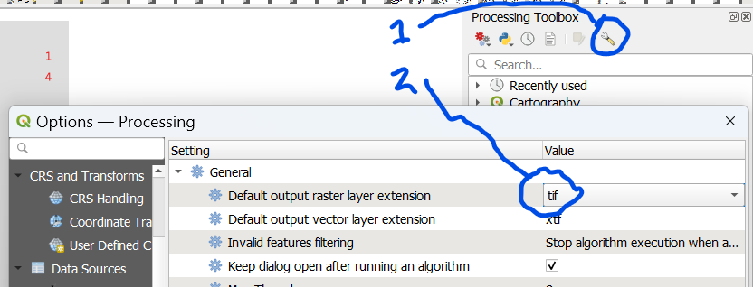

# Fire2a QGIS-Toolbox

This type of plugins are designed following a data pipeline architecture principle. 
With clearly delimited components: input, output, algorithm and context; it achieves a better integration with QGIS APIs, providing 3 different interfaces:
1. A window dialog on the [processing toolbox](https://docs.qgis.org/latest/en/docs/user_manual/processing/toolbox.html) interface
2. A [command line interface](https://docs.qgis.org/latest/en/docs/user_manual/processing/standalone) using `$ qgis_process`
3. A python interface that can be used either 
    on the [QGIS console](#script-in-qgis-console)
    or as a [standalone](https://raw.githubusercontent.com/fire2a/fire-analytics-qgis-processing-toolbox-plugin/main/script_samples/standalone.py) script.
4. Modeler interface component? (not sure about this one)

The idea behind this architecture is that the user composes its own pipeline, combining different algorithms to achieve their goal. This is a more flexible, reusable, scalable and easier to mantain approach than independent QGIS plugins, where each one is designed to a specific need with custom inputs, outputs and behavior. Making it nearly impossible to use them outside the window dialog mode less combining them.

{: .warning}
Windows users must set `.tif` as their default raster format


# Algorithms
## Raster knapsack optimization
### Intro
_A proof-of-concept integration of mathematical programming solvers to model and solve optimization problems with GIS entities._

Users can create a new raster layer that selects the most valuable pixels in a raster, according to a capacity constraint defined by another -optional- raster and a fractional ratio.

Several solvers can be used (cbc, glpk, cplex_direct, gurobi, ipopt, NEOS, etc.), thanks to the MIP being modeled and solved through [pyomo](http://www.pyomo.org).

Before running this algorithm, make sure that you have installed the corresponding solvers that you want to use. See [pyomo documentation](https://pyomo.readthedocs.io/en/stable/installation.html#conditional-dependencies) for more  details.

| screenshot |
| --- |
||

### Detailed description
By selecting a Values layer and/or a Weights layer, and setting the bound on the total capacity, a layer that maximizes the sum of the values of the selected pixels is created.

The capacity constraint is set up by choosing a ratio (between 0 and 1), that multiplies the sum of all weights (except no-data). Hence 1 selects all pixels that aren't no-data in both layers.

This raster knapsack problem is NP-hard, so a MIP solver engine is used to find "nearly" the optimal solution, because -often- is asymptotically hard to prove the optimal value. So a default gap of 0.5% and a timelimit of 5 minutes cuts off the solver run. The user can experiment with these parameters to trade-off between accuracy, speed and instance size(*). On Windows closing the blank terminal window will abort the run!

By using Pyomo, several MIP solvers can be used: CBC, GLPK, Gurobi, CPLEX or Ipopt; If they're accessible through the system PATH, else the executable file can be selected by the user.

Installation of solvers is up to the user, although the windows version is bundled with CBC unsigned binaries, so their users will face a "Windows protected your PC" warning, please avoid pressing the "Don't run" button, follow the "More info" link, scroll then press "Run anyway".

(*): Complexity can be reduced greatly by rescaling and/or rounding values into integers, or even better coarsing the raster resolution (see gdal translate resolution).

__Installation instructions [here](./plugin_installation.md)__  
__QGIS-plugin-repo [link](./plugins.xml)__  

# Usage
## window dialog
1. Open QGIS Processing Toolbox (the cog icon)
2. Type or navigate to: Fire2a > Raster Knapsack Optimization
3. Select one or two layers, input the capacity ratio
4. Click Run

## command line

## standalone script

## script in QGIS Console

```
from qgis import processing
result = processing.run(
    "Fire2a:Raster Knapsack Optimization",
    {
        "INPUT_ratio": 0.06,
        "INPUT_value": "/path/to/raster.any_supported_extension",
        "INPUT_weight": None,
        "OUTPUT_csv": "TEMPORARY_OUTPUT",
        "OUTPUT_layer": "TEMPORARY_OUTPUT",
        "SOLVER": "cbc: ratioGap=0.001 seconds=300",
        "CUSTOM_OPTIONS_STRING": "",
    },
)
QgsProject.instance().addMapLayer(result['OUTPUT_layer'])
```

# Template
[This repo](https://github.com/fdobad/qgis-processingplugin-template) is a template for QGIS processing toolbox [plugins](https://plugins.qgis.org).

---
[QGIS]: https://qgis.org
[requirements.txt]: https://raw.githubusercontent.com/fire2a/fire-analytics-qgis-processing-toolbox-plugin/main/fireanalyticstoolbox/requirements.txt 
[requirements.dev.txt]: https://raw.githubusercontent.com/fire2a/fire-analytics-qgis-processing-toolbox-plugin/main/requirements.dev.txt
[Scott&Burgan-dialog-server]: https://fdobad.github.io/qgis-processingplugin-template/plugins.xml
[Kitral simulator dialog-server]: https://fdobad.github.io/fire2am-kitral/plugins.xml 
[Processing-Toolbox-server]: https://fire2a.github.io/fire-analytics-qgis-processing-toolbox-plugin/plugins.xml
[toolbox-releases]: https://fire2a.github.io/fire-analytics-qgis-processing-toolbox-plugin/releases
[toolbox-repo]: https://www.github.com/fire2a/fire-analytics-qgis-processing-toolbox-plugin
