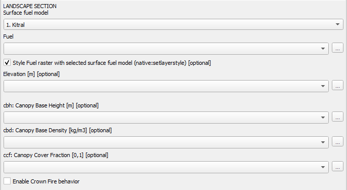
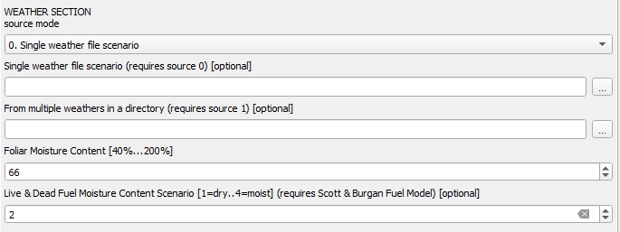
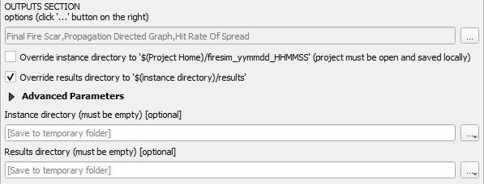
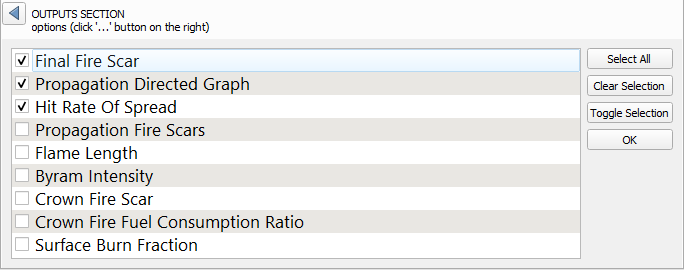

{: .no_toc}

  

    Tabla de contenidos
  

  {: .text-delta }
1. TOC
{:toc}

# Preparación de datos
## Rasters
* Las instancias preparadas están disponibles con el algoritmo "descargador de instancias"
* Todos los rásteres (y el proyecto) deben estar proyectados en el mismo SRC, en metros cuadrados
* Usando el ráster de combustible como base, los rásteres deben coincidir:
    - En número de píxeles en ambas direcciones
    - A lo sumo un desplazamiento de un píxel en cada dirección
    - Por lo tanto, el tamaño del píxel debe ser muy cercano [~mm]

| rásteres | propósito | unidades |
| --- | --- | --- |
| combustibles | codificar el paisaje | tabla de modelos de combustible |
| elevación | dem | metros |
| cbh | altura de la base del dosel es donde está la rama más baja | metros |
| cbd | densidad a granel del dosel | kg/m3 |
| ccf | fracción de cobertura del dosel es como un indicador de cobertura de nubes | [0,1] |
| py | mapa de densidad de probabilidad es para dibujar igniciones | [0,1] |

## Clima
**Especificación de la tabla Weather.csv:**
* columnas mínimas: `name,timestamp,wind-speed,wind-direction`
* filas: por defecto cada fila dura una hora
* columnas dependientes del modelo de combustible:

Canadá
: `Scenario,datetime,APCP,TMP,RH,WS,WD,FFMC,DMC,DC,ISI,BUI,FWI`

Kitral
: `Instance,datetime,WS,WD,TMP,RH`  

Scott&Burgan
: `Scenario,datetime,WS,WD,FireScenario`  

* FireScenario fue deprecado por "Live & Dead Fuel Moisture Content Scenario [1=seco..4=húmedo]"
* No es necesario ser consistente con las marcas de tiempo, pero se debe seguir la isoformat `AAAA-MM-DDTHH:MM:SS`
* TrabajoEnProgreso: unificar formatos de clima, confiar en los nombres de las columnas en lugar del orden para leerlos

<a href="#top">volver_arriba</a>
{: style="text-align: right;"}

# Rellenando el diálogo
El diálogo del simulador se divide en cuatro secciones principales: *Paisaje, igniciones, clima y salidas*. Y dos opcionales: configuración de ejecución y opciones avanzadas.
Aunque intuitivo (por ejemplo, hacer coincidir cada unidad dimensional mostrada entre corchetes), cada sección se comenta a continuación:

## Paisaje
{: width="85%"}
* El modelo de combustible de superficie debe coincidir con la codificación del ráster de combustible (ver [tablas de búsqueda])
* La casilla de verificación de estilo de ráster no solo "pinta" usando el algoritmo 'native:setlayerstyle' según cada  [capa de estilo qml], sino que también muestra la clasificación en el panel de capas
* Habilitar el comportamiento del fuego de copa tiene sentido *incluso sin rásteres de dosel porque hay números estándar fijos* para ellos según la codificación del combustible (solo disponible en el modelo de combustible de Canadá)

<a href="#top">volver_arriba</a>
{: style="text-align: right;"}

## Igniciones
{: width="85%"}
* Al simular **una o pocas simulaciones**, obtener una salida detallada es relevante (como **digrafo de propagación y cicatrices de propagación**)
* Al simular **cientos o miles**, las estadísticas de media y desviación estándar son más importantes que una salida detallada que puede ahogar innecesariamente la computadora (usar **cicatriz final** en lugar de cicatrices de propagación; el digrafo de propagación es la entrada para las medidas de DPV y Centralidad; pero no se podrá cargar en la vista!)
* Hay 3 formas de generar igniciones:
&nbsp; 0. Sortear un píxel aleatorio pero quemable **distribuido uniformemente**
&nbsp; 1. Sortear usando un ráster de **mapa de probabilidad**
&nbsp; 2. Especificar un **punto** y opcionalmente un radio para especificar un **círculo** desde donde sortear uniformemente
* Si se pasan varios puntos en la "capa de un solo punto", solo se tomará en consideración el último[?] (ver id de característica (fid) en la tabla de atributos de la capa)
* Tenga en cuenta que hay una entrada para definir semilla aleatoria, por lo tanto, la misma semilla implica dibujar el mismo punto (o secuencia de puntos)

<a href="#top">volver_arriba</a>
{: style="text-align: right;"}

## Tiempo Atmosférico
{: width="85%"}
* El simulador asume **parámetros meteorológicos constantes en la cuadrícula**, pueden cambiar con el tiempo, pero no en el espacio
* Estos parámetros se pasan al simulador usando un archivo `.csv`
* En una simulación regular **cada fila dura 1 hora**, cuando las filas terminan, la simulación termina
* Hay dos opciones:
&nbsp; 0. Usar solo un `Weather.csv`
&nbsp; 1. Sortear al azar de un directorio `Weathers/WeatherN.csv : N = 1,2,...` nombrado correlativamente
* TrabajoEnProgreso: una base de datos meteorológica; mientras tanto, los climas se pueden obtener de *weather.org desde cualquier ubicación desde 1970 hasta la fecha actual*

volver a <a href="#weather">especificacion del tiempo</a> \| <a href="#top">arriba</a>
{: style="text-align: right;"}

## Configuración de ejecución
{: width="85%"}
* Solo baje los hilos de la CPU de la simulación si planea seguir trabajando en otra cosa mientras las simulaciones se ejecutan en segundo plano (para la oficina o la navegación web nunca necesitará más de 2)
* Llevar un registro de la semilla garantiza la reproducibilidad de todos los números aleatorios generados

<a href="#top">volver_arriba</a>
{: style="text-align: right;}

## Salidas
Esta sección tiene tres partes principales: opciones, avanzadas y directorios de destino.
{: width="85%"}

### Opciones
* Acceda a la selección múltiple haciendo clic en los `...` a la derecha
{: width="85%}
* La mayoría de las salidas se adaptan según sean 1 o >1 simulaciones
* Al simular **una o pocas simulaciones**, una salida detallada es relevante (como **digrafo de propagación y cicatrices de propagación**)
* Al simular **cientos o miles**, las estadísticas de media y desviación estándar son más importantes que una salida detallada que puede ahogar innecesariamente la computadora (usar **cicatriz final** en lugar de cicatrices de propagación; el digrafo de propagación es la entrada para las medidas de DPV y Centralidad; pero no se podrá cargar en la vista!)

| nombre de la salida | tipo de unidad | descripción |
|:-------------|:------------------|:------|
| Cicatrices finales | ráster `0,1` |  |
| Gráfico dirigido de propagación | líneas vectoriales `períodos` | bordes etiquetados con el tiempo del evento de simulación |
| Tasa de propagación de incendios | ráster float32 `m/m` | multibanda x simulación y bi-banda media y desviación estándar |
| Cicatrices de propagación de incendios | polígonos | _animar añadiendo la columna_ `=now()+ make_interval(hours:=time)` |
| Longitud de la llama | ráster float32 `m` | multibanda x simulación y bi-banda media y desviación estándar |
| Intensidad de la línea de fuego de Byram | ráster float32 `kW/m` | multibanda x simulación y bi-banda media y desviación estándar |
| Cicatriz de incendio de copa | ráster `0,1` | multibanda x simulación y bi-banda media y desviación estándar |

<a href="#top">volver_arriba</a>
{: style="text-align: right;}

### Opciones Avanzadas
* 

Desplegar el bloque usando el triángulo
 a la izquierda de Parámetros Avanzados

{: width="85%"}
* Cualquier~~cosa~~ **parámetros de línea de comandos pueden ser añadidos**, consulte [Cell2Fire.ReadArgs.cpp](https://github.com/fire2a/C2F-W/blob/main/Cell2FireC/ReadArgs.cpp#L40), and [firetoolbox.config]() para documentación
* **Dry run** es útil para construir la carpeta de la instancia y obtener la línea de comandos completa que se ejecutaría, como una forma de **verificar o modificar** la instancia antes de ejecutar
    1. Los usuarios de Windows deben abrir la terminal de OSGeo4W antes de ejecutar cell2fire.py
    2. Cambie el directorio a `path` antes de ejecutar el comando

<a href="#top">volver arriba</a>
{: style="text-align: right;"}

### Directorios de destino
* El simulador define directorios de entrada y salida (instancia y resultados), reduciendo la complejidad al nombrar siempre los archivos de la misma manera; Fire2a-toolbox se encarga de construir estos directorios y escribir archivos con los nombres adecuados [y formatos... próximamente].
* **tmp significa sin preocupaciones**: Por defecto, los algoritmos de procesamiento de QGIS se ejecutan en memoria y/o se escriben en directorios temporales; *la ventaja es comenzar siempre desde una pizarra limpia y limpieza asistida por el sistema operativo, evitando que las unidades en la nube se desordenen; pero la desventaja es que es un poco engorroso llegar a esas ubicaciones temporales*. El complemento "Save All" codifica y guarda todas las capas cargadas actualmente donde elija, úselo después de cargar los resultados y nunca se preocupe por especificar directorios.
* Hay 3 estrategias -mutuamente excluyentes- para especificar dónde construir los directorios de instancia y resultados:

Temporal
: No rellene nada, ¡recomendado! (por defecto vacío)

Manualmente
: especifíquelos: por ruta absoluta o relativa al directorio de inicio del usuario[?]

Instancia a lo largo del proyecto
: Se creará un directorio llamado `firesim_YYMMDD_HHMMSS`; el proyecto debe guardarse [en una ubicación sin espacios en su ruta]

Resultados dentro de la instancia
: Se creará un directorio llamado `results` dentro de la instancia (por defecto)

<a href="#top">volver arriba</a>
{: style="text-align: right;"}

# Diálogo completo
{: width="85%"}

---
[tablas de búsqueda]: https://github.com/fire2a/fire-analytics-qgis-processing-toolbox-plugin/tree/main/fireanalyticstoolbox/simulator
[capa de estilo qml]: https://github.com/fire2a/fire-analytics-qgis-processing-toolbox-plugin/tree/main/fireanalyticstoolbox/simulator
